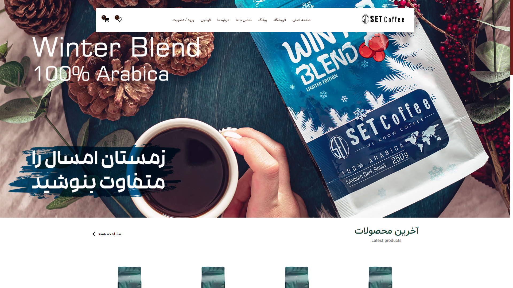
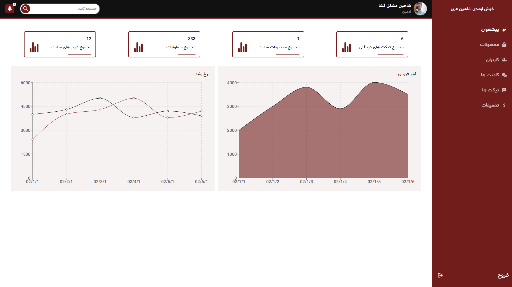
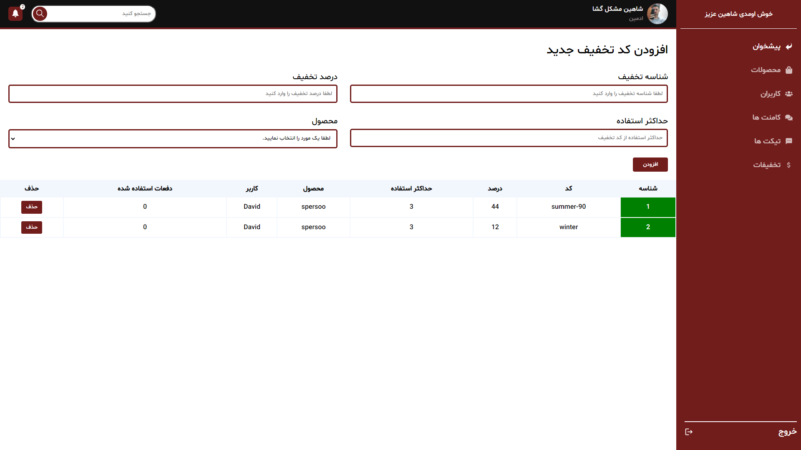
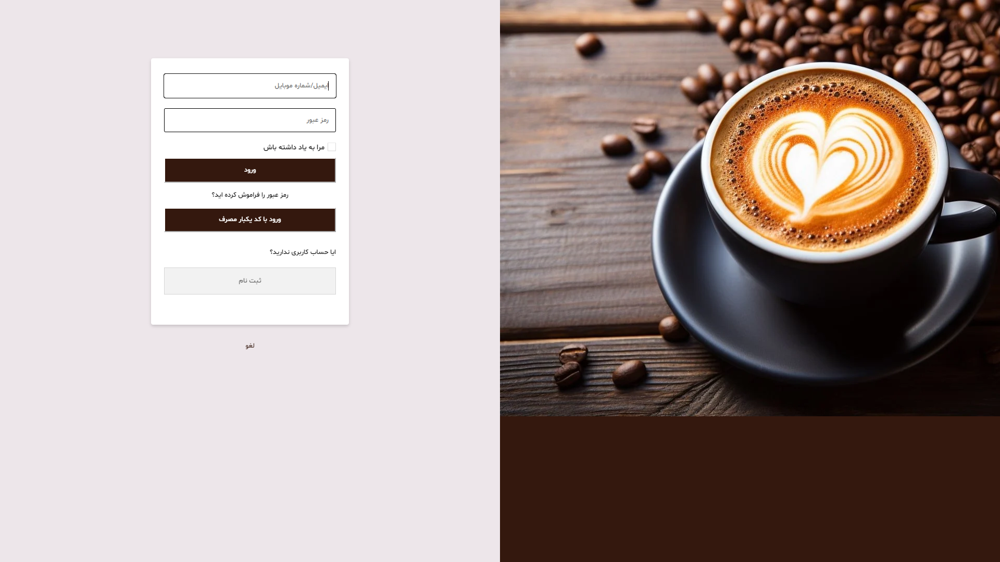
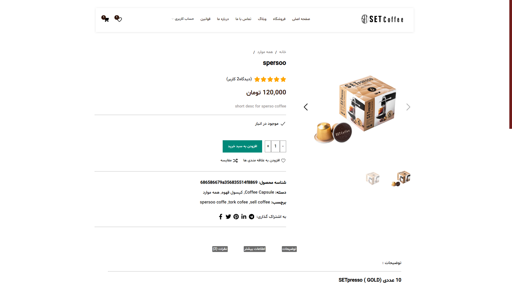
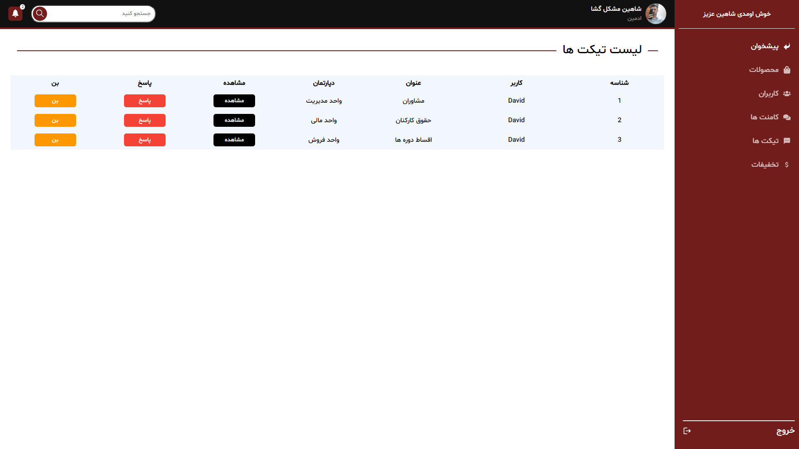
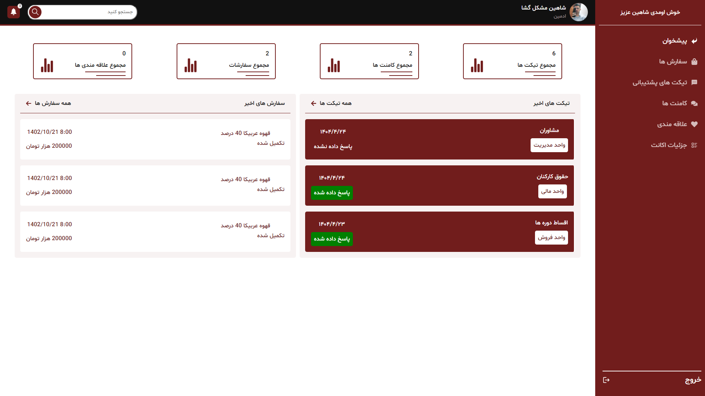

# ☕ Set Coffee Shop - Fullstack Clone

This project is a **full-featured e-commerce clone** of the [Set Coffee Shop](https://set-coffee.com/set-shop/), built with a modern web tech stack. It includes a complete CMS-like admin panel and robust user-facing features — just like a real online store.

---

## 🚀 Features

- 🧾 Login & Register forms
- 🧑‍💼 Dedicated Admin Panel
- 👤 Dedicated User Panel
- ➕ Add New Products (Admin only)
- ⭐ Product Rating System
- 📊 User Activity Log
- ❤️ User Favorites
- 🎫 Ticketing System (User submission & Admin response)
- 🔐 Role-Based Access Control (Admin can manage/ban users)
- 🔑 Token-based Authentication
- 📤 File/Image Uploader
- 💸 Discount Code System
- 🛒 Shopping Cart
- 💬 Admin Moderation of Comments
- ⚙️ ...and more!

> ✅ Acts like a **real-world e-commerce site with CMS capabilities**.

---

## 🛠 Tech Stack

- **Next.js** (React Framework)
- **React.js**
- **MongoDB + Mongoose**
- **Next.js API Routes**
- **JWT Authentication**
- **CSS Modules**
- **Cloudinary** (optional for image uploads)
- **Nodemailer** (optional for email/ticket system)

---

## 📦 Getting Started

1. Clone the repository:

   ```bash
   git clone https://github.com/YourUsername/set-coffee-clone.git
   cd set-coffee-clone
   ```

2. Install dependencies:

   ```bash
   npm install
   ```

3. Create a `.env.local` file and configure:

   ```env
   MONGODB_URI=your_mongodb_connection_string
   JWT_SECRET=your_jwt_secret
   CLOUDINARY_CLOUD_NAME=your_cloud_name
   CLOUDINARY_API_KEY=your_api_key
   CLOUDINARY_API_SECRET=your_api_secret
   ```

4. Run the development server:

   ```bash
   npm run dev
   ```

5. Visit [http://localhost:3000](http://localhost:3000)

---

## 🌐 Deployment

You can deploy this project on platforms like **Vercel**

#### 📌 Deploy on Vercel:

- Push to GitHub
- Go to [vercel.com](https://vercel.com) and import the project
- Add environment variables
- Click **Deploy**

---

## 📸 Screenshots (Optional)

### 🏠 Homepage



### Admin Page



### 🏠 Discounts Handler



### 📝 Login



### 🏠 Product Detail Page



### 📝 Ticket Page



### 📝 User Panel

## 

## ⚠️ Disclaimer

This project was built for educational and portfolio purposes.  
It is **not affiliated** with or endorsed by **Set Coffee**.

---

## 🧑‍💻 Author

Made with ❤️ by [Davodev]
